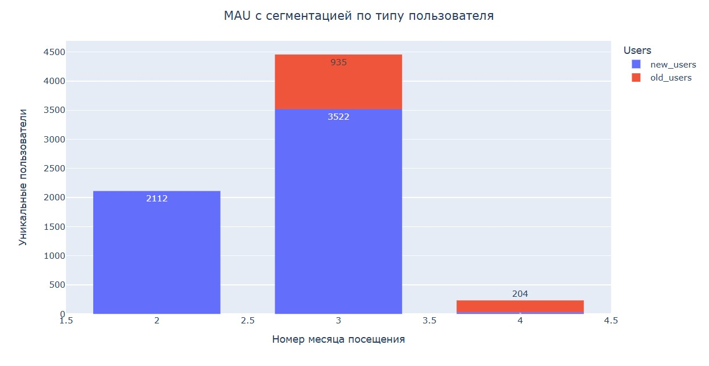
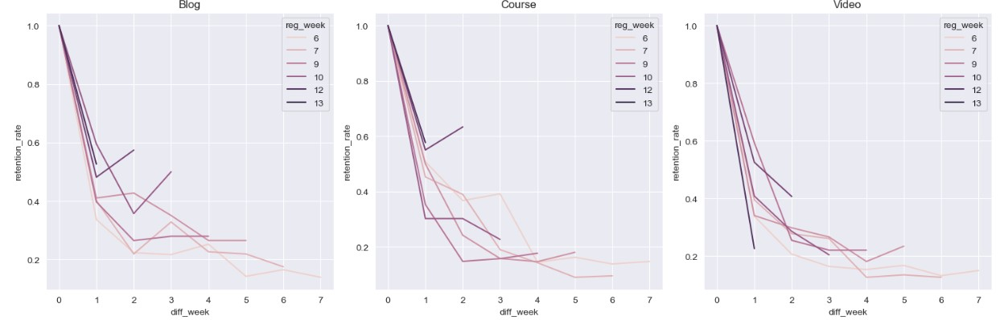
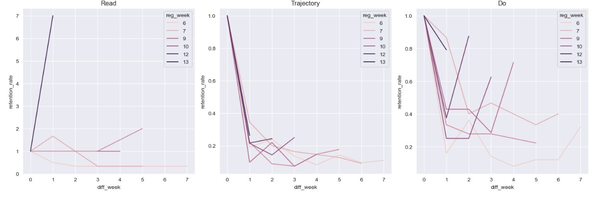
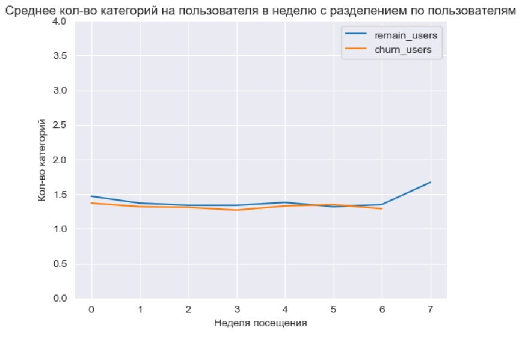
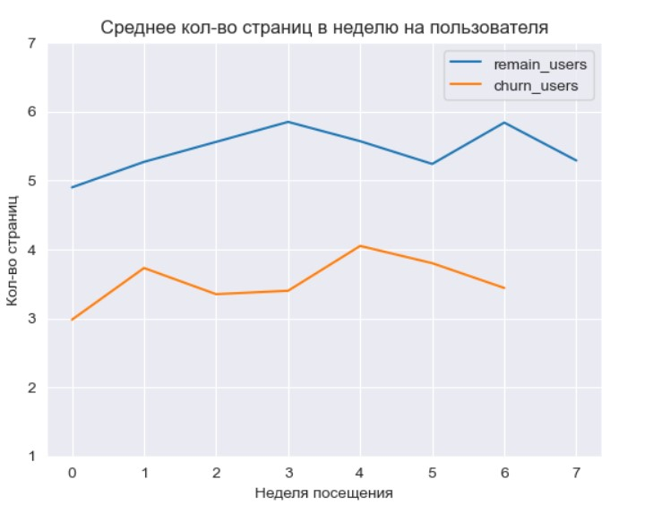
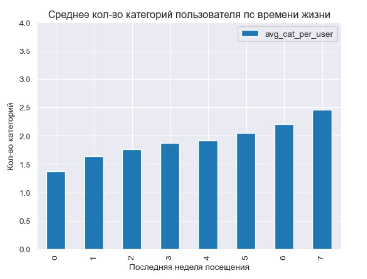

# EDA образовательной платформы
## О проекте
В этом проекте мы будем работать с данными образовательной платформы для предпринимателей, посчитаем основные и custom метрики, проанализируем паттерны оставших и ушедших пользователей, а также проведем когортный анализ и сформируем предложения по улучшению платформы.
## Задачи анализа
- Определить самые популярные разделы.
- DAU, WAU, MAU.
- Lifetime.
- Retention.
- Сustom metrics
- Выявить паттерны ушедших и оставшихся пользователей.
## Стек

## Входные данные
### events.csv
|  Тип данных   |              Описание                    |
|---------------|------------------------------------------|
| `visit_date`    | Дата посещения                           |
| `URL_visited`   | Адрес веб-страницы                       |
| `user_id`       | Уникальный идентификатор пользователя    |
| `user_reg_date` | Дата регистрации пользователя            |

## Кастомные метрики
- Среднее кол-во категорий на пользователя в неделю ( среднее кол-во категорий в неделю, которые смотрит пользователь).
- Среднее кол-во категорий на пользователя по lifetime (среднее кол-во категорий, которые посмотрел пользователь в зависимости от времени жизни пользователя).
- Доля пользователей за неделю, которые посмотрели все категории.
- Доля пользователей за неделю, которые посмотрели не менее половины категорий.
- Доля пользователей, которые посмотрели все категории за всё время, в зависимости от недели ухода пользователя.
- Доля пользователей, которые посмотрели хотя бы половину категорий за всё время, в зависимости от недели ухода пользователя.
- Среднее кол-во страниц в неделю, которые смотрит пользователь.

## Вывод

- **`MAU, WAU, DAU`**
  
  MAU в Марте увеличился в 2 раза, благодаря тому что новых пользователей стало в 1,5 раза больше и также вернулась некоторая часть старых. В 4 месяце всего один день, поэтому MAU в нем маленькое. 
   
  WAU 10 недели было самое маленькое, так как в эту неделю было 2 праздничных дня.
  Рост 12 и 13 недели обусловлен в основном притоком новых пользователей. В 12 неделю пришло почти в 3 раза больше новых пользователей, по сравнению с предыдущей неделей, а в 13 неделю пришло аж в 7 раз больше новых пользователй, по сравнению с предыдущей неделей.
  
  В конце марта был большой наплыв пользователей. Обычно старых пользователей в день заходят больше чем новых.

  `Общий вывод`
    В 12, 13 неделю пришло много новых пользователей, за счёт чего вырос MAU Марта, WAU и DAU 12, 13 недели.

- **`Популярные разделы`**
    
  Самыми популярными разделами является **'course', 'blog', 'video'**. За всё время каждый из них просмотрели более 2000 пользователей, раздел read самый непопулярный, его просмотрели только 58 человек. Возможно, есть похожие разделы, например blog, который лучше закрывает потребности пользователей.

- **`Lifetime`**
  За 8 недель жизни платформы средний Lifetime составил 1.6 недель, это достаточно мало, необходимо растить этот показатель.

- **`Retention`**
  -  `Когоротный анализ`
      
  Наблюдается падение retention на всех неделях посещения. Можем разделить это падение на 2 периода. Первый с когорты 6 недели регистрации по 11 неделю регистрации, когда retention падал плавно в пределах 1-3% в каждую неделю посещения, второй на когорту с 12 недели регистрации, где падение было уже 8%. 
  - `Retention по категории контента`
      
     
    Падение в первом периоде может быть связано с паденеием retention в категориях course и trajectory. Во втором периоде(когорта 12 недели) был большой приток новых пользователей, обычно это отрицательно влияет на retention.
  - Общего падения retention в категориях не наблюдается, тем не менее в категориях course и trajectory новые когорты показали себя хуже.
  - Retention 7 недели составляет всего 2%, что достаточно мало.
  - `Retention за всё время`
        
      Retention за всё время не выходит на плато, что говорит о том, что пользователи не находят ценности данной платформы.

- **`Custom metrics`**
  - `Среднее кол-во категорий в неделю, которые смотрит пользователь`
    
  - `Среднее кол-во страниц в неделю, которые смотрит пользователь.`
    
  - `Cреднее кол-во категорий, которые посмотрел пользователь в зависимости от времени жизни пользователя`
    
  
  Ушедшие и оставшиеся пользователи смотрят одинаковое кол-во категорий в неделю, примерно 1.4, но оставшиеся пользователи в среднем в неделю смотрят на 2 страницы больше, то есть у осташихся пользователей, всегда больше глубина просмотра, об этом нам говорит метрика `cреднее кол-во страниц в неделю, который посмотрел пользователь`. Важно отметить, что чем больше пользователь остаётся на платформе, тем больше категорий начинает смотреть.

## Каких данных не хватило?
1. О дате и теме публикации. Мы бы проанализировали структуру популярных материалов и узнали, что делает их более привлекательными для пользователей или что отталкивает.
2. Источники трафика. Для понимания какие каналы более эффективны, и с каких каналов приходили пользователи на 13 неделю.

## Рекомедации

1. **Ввести систему оценки материала.**   Дать пользователю возможность оценивать материал (понравилось/непонравилось). Таким образом, мы сможем понимать какой материал пользователям не нравится, и отслеживать пользователей, кототрые могут потенциально уйти из платформы. Также это поможет узнать, что делает материалы более привлекательными для каждого раздела.   Данное изменение позволит увеличить retention и dau, благодаря тому, что качество контента станет лучше.

2. **Ввести рекомендательную систему "Вам может понравится"**.   Она будет рекомедновать материалы подобные тем, которые понравились пользователю.   Данное изменение позволит увеличить retention и dau, благодаря тому, что пользователи буду сразу находить интересные для себя темы и читать больше конента.

3. **Приглашать пользоватей из других разделов в раздел course.**   Например, пользователь посмотрел видео по тематике "торговля в интернете" на нашей платформе, приглашаем его на наш курс, который посвещен этой теме.   Так как в этом разделе самый большой retention, приглашая пользователя в него, мы будем понимать, что пользователь может там задержаться и общий retention вырастит.  

4. **Ввести онбординг пользователя и отслеживать метрики в нём.**   На этом этапе мы доносим до пользователям наши основные фишки и преимущества, нам также необходимо понимать, с какими сложностями сталкивается пользователь при знакомстве с приложением. Этим изменением мы сможем увеличить retention первой недели и снизить отток пользователей. Метриками того что онбординг помогает, может также служить retention 7 дней, срденее кол-во просмотренных страниц на пользователя, после введения онбординга эти метрики должны увеличиться.
